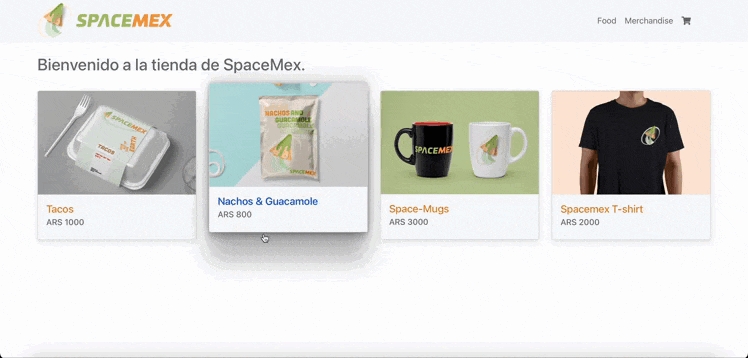

# SpaceMex Store

Bienvenidos a la tienda virtual de SpaceMex, este es un proyecto realizado para el curso de ReactJS dictado por CoderHouse.

### Dependencies

##### Font Awsome

Esta dependencia nos permite trabajar con icons para poder importarlos en nuestro proyecto, me pareció importante agreagar esta librería ya que en el avance del proyecto necesitaremos agregar iconos, como por ejemplo en el footer con las redes sociales.

##### React Bootstrap

Esta dependencia es importante para agregar estilo a nuestra web app de manera rápida y eficiente, la librería de bootstrap es util a la hora de realizar proyectos de fácil mantenimiento y componentes reutilizables en el desarrollo de nuestra aplicación.

### App flow

